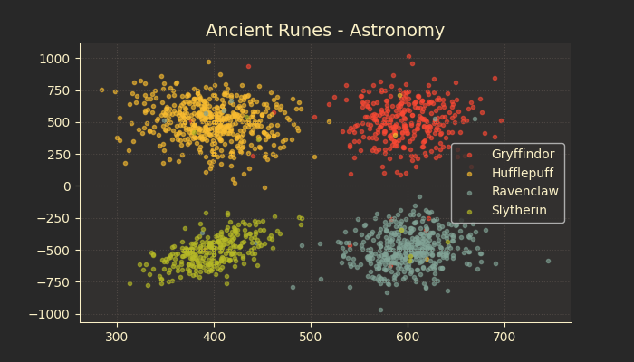
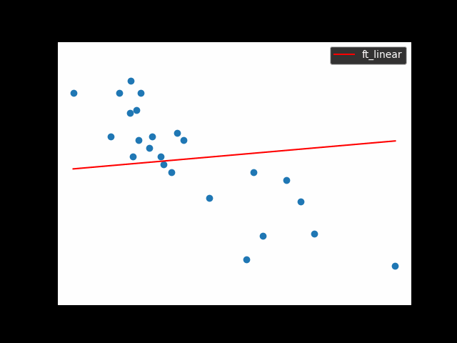

### [Datascience X Logistic Regression](https://github.com/plagache/DSLR)
_from june 2023 to present_  

The aim of the project is to implement a linear classification model with logistic regression.
We are tasked to recreate the Sorting Hat of Hogwarts: it was used to determine which of the four school Houses was the best fit for each new student.  
What I learned during this project:
- How to perform a logistic regression on a given dataset
- What is a classifier and how to build one
- Work with matrix multiplication in Python

Using a flask webserver to display some plots:

With a gradio interface to help training, validation and prediction

---

### [Linear Regression](https://github.com/lagachea/linear-regression)
_from november 2020 to may 2023_  

The aim of this project is to introduce to the basic concept behind machine learning.
Here we create a program that predicts the price of a car by using a linear function train with a gradient descent algorithm.  
What I learned during this project:
- How to perform a gradient descent
- How to plot data using matplotlib

---
