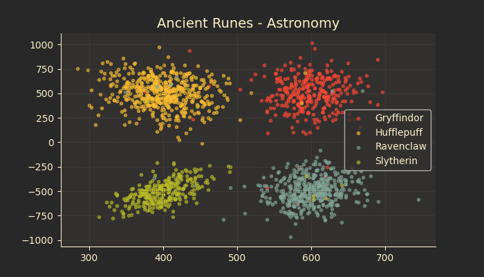
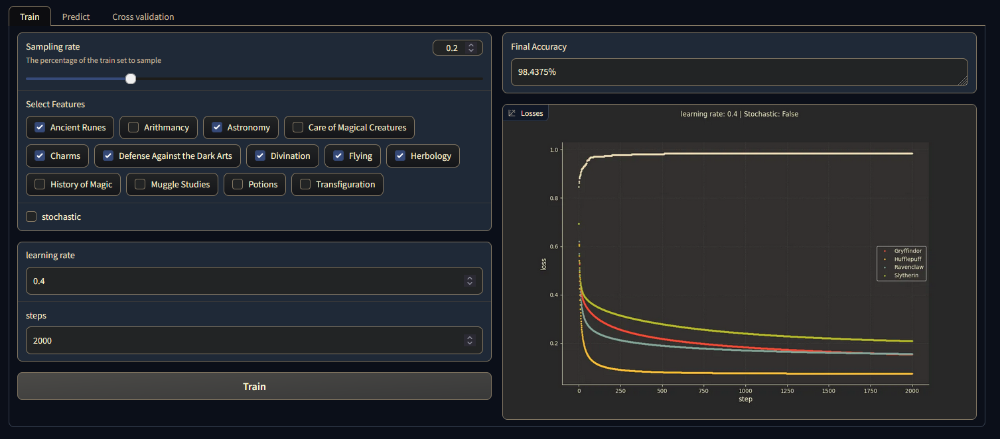
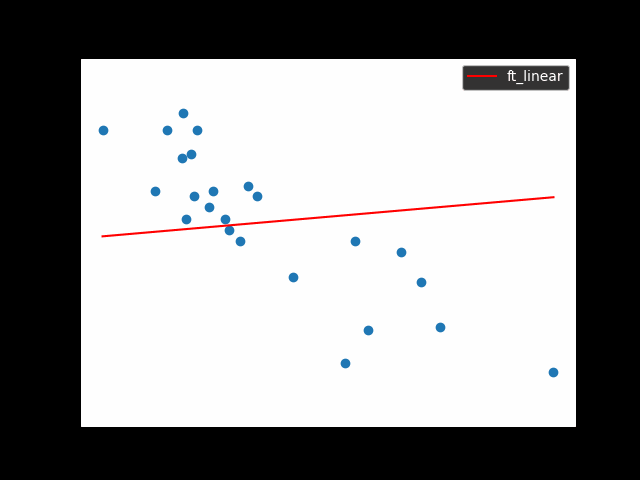
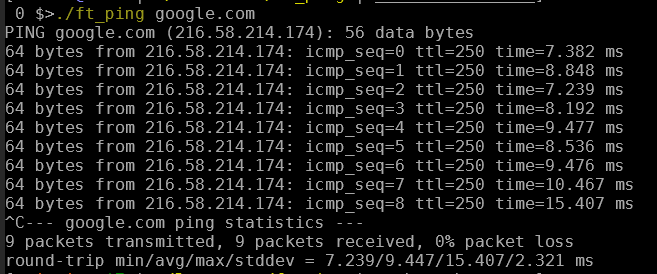

## Welcome to my portfolio
I am Alexandre Lagache a software developer from France.
I like to work with Python and C to design some simple solutions to complex problems.
Here are a few ways to [contact](#contact-and-informations) me.

---
## machine learning:
- [Datascience X Logistic Regression](#datascience-x-logistic-regression)
- [Linear Regression](#linear-regression)

## system and network:
- [Inception of things](#inception-of-things)
- [Ft_ping](#ft_ping)

---

## Datascience X Logistic Regression

The goal of [DSLR](https://github.com/plagache/DSLR) is to implement a linear classifier using logistic regression.

- I performed a statistical and graphical analysis of the dataset.
Here is a scatter plot of two features that are great predictors for the classes.

- I trained the model using gradient descent, to help I created an interface to edit parameters.

---

## Linear Regression

I created a [linear regression](https://github.com/lagachea/linear-regression) model using gradient descent.
The program generates a gif of the states of the model during training.
The last image shows both my model and the model form numpy library among the points of the dataset.  

---

## Inception-of-Things

As the name implies [Inception-of-Things](https://github.com/plagache/inception_of_things) is about mastering containerisation and virtual machines deployment from within a virtual machine.  
- I created two virtual machines using vagrant. Both machine have kubernetes (k3s), one being the server and the other the server worker.
- I deployed multiple applications inside a kubernetes (k3s) instance, and wrote ingress rules to communicate with each application.
- I set up a continuous integration of a git repo using argoCD.

---

## Ft_ping

[Ft_ping](https://github.com/lagachea/ft_ping) is a rewrite of the ping command in C.
I wanted to understand how the internet traffic works and how a unix system handles network operations.
- I created IP and ICMP packets.
- I sent and received packets using a raw socket.
- I worked with real time network operations.

This is an example of call to ft_ping to google.com.

---
## Contact and informations
<!--Mobile: [06 33 35 10 44](tel:+33633351044)  -->
Email: [lagachea@proton.me](mailto:lagachea@proton.me)  
Profile github: [https://github.com/lagachea](https://github.com/lagachea)  
Profile malt: [https://www.malt.fr/profile/alexandrelagache](https://www.malt.fr/profile/alexandrelagache)

